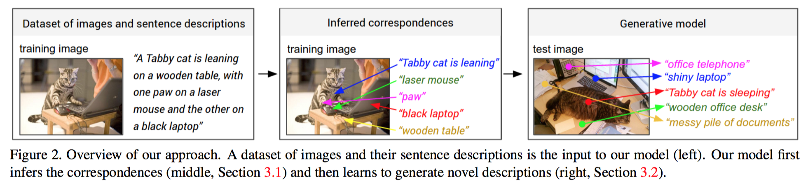

# Deep Visual-Semantic Alignments for Generating Image Descriptions

## 2015

## 一句话摘要

本作即neuraltalk2的文章, Torch实现。标准的image captioning。

## 摘要

我们呈现了一个可以用自然语言描述图片的模型。我们的方法通过从图片和对应描述的数据集中学习他们之间的联系。我们的联合模型是把处理图片的CNN和用于处理句子的双向RNN(bidirectional RNN)组合起来，通过多模型embedding组合得到一个结构化的目标。本作然后描述如何使用推理出的联系在多模型RNN架构中去学习如何生成图片的描述。结果表明本作的联合模型在数据集（Flickr8K, Flickr30K, MSCOCO）检索实验中表现优异。最后，我们证明了通过使用生成的图片描述，极大的提高了在全图和一个新的region-level标注数据集的检索基线。

We present a model that generates natural language descriptions of images and their regions. Our approach lever- ages datasets of images and their sentence descriptions to learn about the inter-modal correspondences between language and visual data. Our alignment model is based on a novel combination of Convolutional Neural Networks over image regions, bidirectional Recurrent Neural Networks over sentences, and a structured objective that aligns the two modalities through a multimodal embedding. We then describe a Multimodal Recurrent Neural Network architecture that uses the inferred alignments to learn to generate novel descriptions of image regions. We demonstrate that our alignment model produces state of the art results in retrieval experiments on Flickr8K, Flickr30K and MSCOCO datasets. We then show that the generated descriptions significantly outperform retrieval baselines on both full images and on a new dataset of region-level annotations.

## 代码

<https://github.com/karpathy/neuraltalk2>

Torch

第一版代码

<https://github.com/karpathy/neuraltalk>

python

## 作者

Andrej Karpathy, Li Fei-Fei

## 模型

输入是图片和文字描述。
第一步通过模型，把句子片段和图片区域正确的关联起来  
(present a model that aligns sentence snippets to the visual regions that they describe through a multimodal embedding)  

第二步是把上一步的结果作为训练数据，喂给RNN模型，用于生成句子片段
(then treat these correspondences as training data for a second, multimodal Recurrent Neural Network model that learns to generate the snippets)

### 把特定的图片区域和文字片段对应起来

人写出来的句子，经常会涉及到图片中的位置。

我们需要能够推断出这些隐含的位置与文字的对应关系。  
只有学到了这种关系，才能根据图片的区域生成文字片段。  

#### 表示图片

使用RCNN  
CNN基于ImageNet训练  
然后基于ImageNet Detection Challenge的200分类精调
使用前19个检测到的区域，外加整幅图片用于计算表示此图的向量  

$
v=W_m[CNN_{\theta_{c}}(I_b)]+b_m
$

$\theta_c$是CNN的参数, 6千万量级
$I_b$是图片bounding box内的像素  
$CNN_{\theta_{c}}(I_b)$是将bounding box转换成4096维的激活向量
$W_m$的维度是$h*4096$, $h$是multimodal embedding space的大小, 约1000到1600

这个公式是把图片转换成了一系列h维的向量$\{v_i|i=1...20\}$

#### 表示文字

为了建立夸模型的关系，我们要让句子中的词语，与图片区域使用相同的$h$空间表示。

基于BRNN
