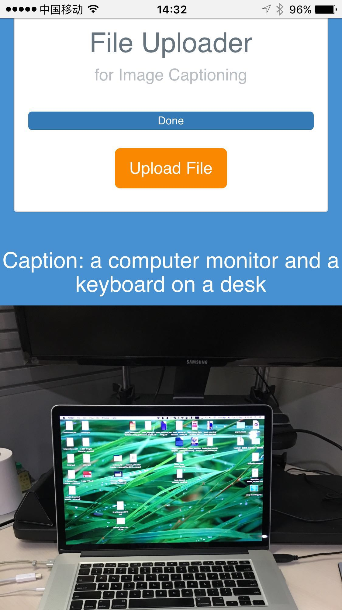

# 让neuraltalks2成为web服务

neuraltalk是一个image caption模型，使用torch作为训练平台。我将其制作成一个web service, 形成端到端的demo, 便于后续改进模型、对比模型。搭建过程简单记录下

搭建neuraltalks2的过程参考之前的文章:  
1. [有网络情况下搭建neuraltalks2](http://wangyang.online/blog/5_neuraltalk_compile/)
2. [无网络下搭建neuraltalks2](http://wangyang.online/blog/6_neuraltalk_compile_without_network/)

web service其实只需要预测过程, 即前向过程, 使用GPU或者CPU都可以。我以eval.th为基础, 利用lua的turbo作为web service framework, 我增加了webservice.th。完整代码参见我的[github上fork的版本](https://github.com/wang-yang/neuraltalk2)

## 搭建过程中的注意点

### 依赖
`webservice.th`依赖turbo和socket 安装

`luarocks install turbo`
`luarocks install socket`

如果没有网络, 到`offline_rocks`中解压缩turbo

`luarocks make turbo的rockspec文件`
`luarocks make socket的rockspec文件`

### 启动命令(CPU模式):
安装neuraltalks2的环境时只需要满足Evaluation即可, web service利用CPU。clone git中的代码, 安装好依赖, 启动服务:  
`th webservice.lua -model model/model_id.t7_cpu.t7 -gpuid -1`  

### 硬件依赖

之前阿里云低配1U 512M不够用了, neuraltalks2的模型尺寸要占用内存1.2G左右, 所以我升级了阿里云的配置到1U 2G(后来又升级到了4G, 2G时模型无法加载)。  
另外, 需要cuda toolkit的支持, ubuntu12.04版本太老, 需要升级到至少14.04。  
阿里云服务器上把数据盘挂在上了,[参考](http://jingyan.baidu.com/article/90808022d2e9a3fd91c80fe9.html), 升级前做了系统盘和数据盘的快照。

升级后要从最基本的创建用户开始做,好在大多都有github的备份。

### 玩法
访问:<http://willwy.com/caption>
1. PC上可以上传图片
2. 手机可以直接拍照上传  

效果如下:

