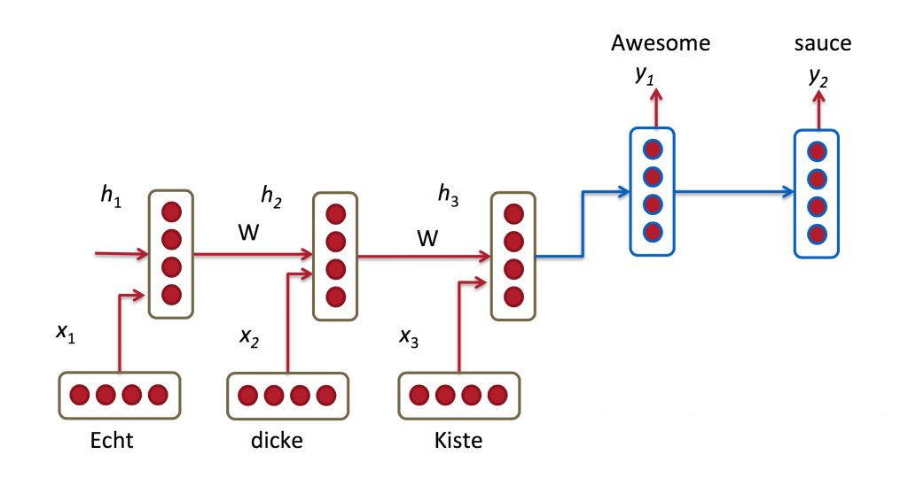
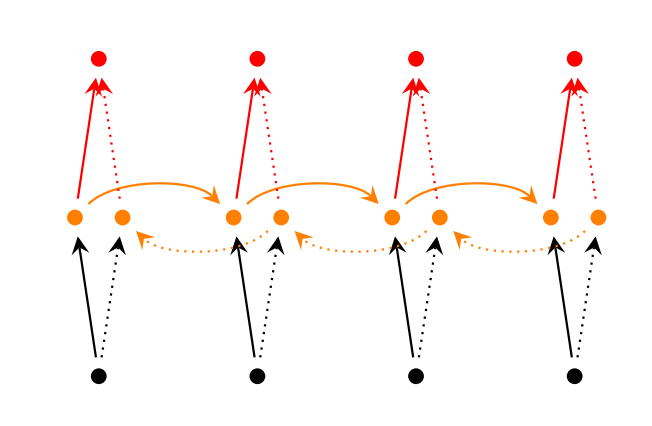
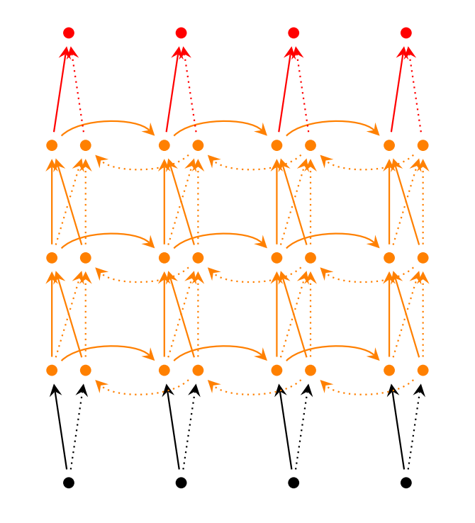

# RNN及LSTM零基础教程

## 一 教程分为如下部分

1. 介绍RNN
2. 用Theano实现RNN
3. 理解BPTT(BackPropagation Through Time)算法和剃度消失问题
4. 实现GRU/LSTM RNN

本教程会实现一个基于RNN的语言模型，这个语言模型的第一个用途可以用来计算任意一句话出现在真实世界中的概率，这种模型一般会用于机器翻译系统。  
第二个用途就是产生新的句子（这个更酷一些）。比如让RNN模型学习了莎士比亚的写作风格后，就能写出类似莎士比亚的句子。

就让我们一步一步开学学习吧。

## 二 什么是RNN呢?

RNN主要是利用序列信息。在传统神经网络中的输入是彼此独立的（输出也是）。但这种独立对于很多任务来说是不利的。如果你想预测一个句子中的下一个单词是什么，最好是知道这个单词之前有哪些单词。RNN中的R是recurrent, 是周期性, 反复的意思, 表示会对句子中的每一个单词用相同的方法处理，让输出基于之前的计算结果。理论上RNN可以利用任意长度的句子，但实际中我们只关注最近的几步。一个典型的RNN示意图如下:


上图是将左侧的RNN展开成完整的网络。展开的意思就是把需要关注的序列对应的网络写出来。比如对于一个句子，我们只关心5个单词，那么RNN网络就被展开成一个5层的神经网络，每一层对应序列中的一个单词。网络中的一些规则定义如下:

* $x_t$表示在t时刻(step)的输入。比如$x_1$是句子中第二个单词对应的one-hot向量(向量中只有1个1，其余都是0)。
* $s_t$是t时刻(step)的隐状态，是网络中作为"记忆"的存在。$s_t$是基于前一个隐状态和当前的输入计算出来的: $s_t=f(Ux_t+W{s_{t-1}})$ 。$f()$通常是非线性函数（如$tanh$, $ReLU$)。初始隐状态$s_{-1}$用于计算第一个隐状态，通常$s_{-1}$被初始化为全0。
* $o_t$是t时刻(step)的输出。比如要预测句子的下一个单词是什么，$o_t$就我们词典中每一个单词出现的概率，$o_t=softmax(Vs_t)$

有些地方需要注意下:

* $s_t$可以被理解为网络的记忆。$s_t$用于捕捉之前的所有时刻发生了啥。本时刻的输出$o_t$完全取决于t时刻的记忆。在实际中会很复杂，因为$s_t$不能捕捉太多之前的步骤。
* 不同于传统的深度神经网络（每层拥有不同的参数），RNN在所有层间（又叫step，跟上面的时刻对应)共享参数$(U, V, W)$ 。实际上我们是在各层执行相同的事情，只是输入不同罢了。这就极大的减少了我们需要学习的参数个数。
* 上面的图中每个step都有输出，但是在实际中不一定每个step都需要输出。比如我们想预测一个句子的感情色彩，我们只关系这个句子的最后输出。同样的，也不是每个step上都需要有输入。RNN的主要特点就在于其隐状态，是用于捕获一些具有顺序特点的信息而已。

## 三 RNN可以做什么呢？

很多NLP任务都可以利用RNN。RNN中最常用的是LSTMs，这个比原始RNNs在捕获有长依赖信息时更好用。LSTMs与RNN从本质上相同，只是在计算隐状态时不同而已。下面是一些RNN的应用例子。

### 1 语言模型以及生成文字

给出一系列的词语，我们希望预测在给定前一个词语时下一个词语的概率。语言模型给了我们可以评估一个句子确实是一个句子的尺子，这在机器翻译中很重要，因为高概率的句子通常是正确的结果。预测下一个词的副产品就是我们得到了一个生成模型，即允许我们生成新的文本。并且根据我们喂给模型的训练数据，几乎可以生成任何相应特点的新句子。在语言模型中个，输入一般是一系列的词（编码成one-hot形式的向量），输出就是预测的词。在训练时，我们设置$o_t=x_{t+1}$，因为在t step时的真正输出是$x_{t+1}$。

### 2 机器翻译



机器翻译跟语言模型很相似，输入都是词语的序列，比如原文是德文，我们希望输出是英文。关键的不同是输出是在我们见过了所有的输入后才有的，因为翻译后的句子的第一个词是需要了解了整个句子原文的。

### 3 语音识别(Speech recognition)

输入声音信号，预测如何根据语音将他们转换成文字。

### 4 生成图片描述

与CNN一起使用, RNN模型作为整体模型的一部分生成未标注图片的描述。组合而成的整体模型可以将从图片里面找到的物品和文字一一对应起来。


图片来源是neuraltalk的大牛Karpathy那里借的:  
<http://cs.stanford.edu/people/karpathy/deepimagesent/>

## 四 训练RNN

训练RNN与训练传统NN类似。同样使用BP算法, 但有一些小变化。因为网络中各层（time steps）共用相同的参数，因此每层输出的梯度不仅与当前的层有关，还有之前的各层。比如要计算t＝4的梯度，我们需要前面3层的梯度，把他们加起来。这个叫做BPTT`Backpropagation Through Time`。但是原始RNN使用BPTT训练长依赖关系时时效果很不好，因为著名的`消失的剃度`问题。LSTM就是解决这个训练长依赖时的难题被设计出来的。

后面会有训练RNN的具体方法及代码。

## 五 RNN的扩展

经年累月，伟大的研究者开发了更加复杂的RNN去解决原生RNN的短处。简单介绍下先。

### 1 双向RNN

主体思想是t时刻输出不仅仅依赖于之前的步骤，还与未来有关。比如想要预测一句话中缺失的单词，考虑句子的上下文显然是更加有效的。双向RNN很简单，仅仅是两个RNN摞在一起，而输出就是基于两个RNN的隐状态。



### 2 深度双向RNN

与双向RNN类似，区别仅仅是在每层中有多个子层而已。实践中这个模型学习能力更好，但也需要更多的训练数据。



### 3 LSTM网络

LSTM最近大热。它与RNN并没有本质的区别，仅仅区别于计算隐状态的方法。LSTM中的记忆体被称作cells，可以被理解为一个黑盒，输入是前一个状态$h_{t-1}$和当前的输入$x_t$。cells内部决定记住哪些（以及删掉哪些）。因此它可以将之前的状态，当前的记忆，以及当前的输入合并在一起。在实践中，这样的cells可以很好的捕获长依赖关系。

## 六 语言模型

在本教程里会用RNN实现一个语言模型。加入我们现在有一个句子，里面有m个单词。语言模型就是预测这个句子出现的可能性，定义如下:

$
P(w_1,...,w_m)=\prod_{i=1}^{m} P(w_i|w_1,...w_{i-1})
$

理解为句子出现的概率是组成其的单词在此单词前面单词出现的情况下出现的概率的乘积（好绕）。比如"He want to buy some chocolate"出现的概率是在给定"He want to buy some"的前提下"chocolate"出现的概率，乘以给定"He want to buy"的前提下"some"出现的概率，以此类推直到第一个单词"He"出现的概率。

为啥这么定义？为啥给一个句子出现的概率？

首先这个语言模型可以被用作一个评分标准。比如一个机器翻译系统对于输入产生了多个候选翻译结果，此时就可以通过语言模型选出出现可能性最高的句子。同样的原理可以应用在语音识别中。

在得到语言模型的同时会得到一个副产品。因为模型可以根据已经前序的单词预测下一个单词出现的概率，我们可以利用此生成新文本，即得到一个生成模型。通过给定已经存在的前序单词序列，我们不断预测下一个出现的单词，直到最终得到一个完整的句子。大神Andrej Karparthy的[demo](http://karpathy.github.io/2015/05/21/rnn-effectiveness/)展示了此能力。通过基于单个字符的训练，可以生成莎士比亚的句子，甚至Linux代码...

语言模型的数学定义是每一个单词的概率是基于所有前序单词。在实际中，鉴于计算和存储的限制很难表示此种长依赖模型，而是仅仅关心当前单词之前的有限个单词。RNNs理论上可以捕获长依赖模型，但会很复杂。

## 七 训练数据和预处理

我们需要文本数据去训练语言模型。幸运的是只需要原始的文本，而不是标注数据。下载15,000个reddit上的比较长的评论用于训练，然后我们的模型生产出的句子就会类似于reddit上的用户写出的评论（希望如此哈）。但再此之前，需要做一些前期工作把原始数据变成可用的格式。

### 1 分词

因为我们希望预测是基于单个单词的，所以我们需要把句子先分成单词。如果简单的根据空格切分句子会无法处理标点符号，比如"He left!"应该被分成"He","left","!"。这个工作交给[NLTK(Natural Language Toolkit)](http://www.nltk.org/)工具去做，利用其`word_tokenize`和`sent_tokenize`方法。

### 2 去掉低频词

训练数据中某些单词仅仅出现一两次，最好把此类词删掉。因为一个巨大的词库会让训练变慢(后面会说为啥变慢)，另外因为这些低频词没有足够多的训练样本，即便参与训练也不能学会正确使用其的方法，就跟人类真正学会使用一个单词时需要在多种上下文中见过他一样。

我们通过参数`vocabulary_size`来限制最多有多少单词参与训练(初始设置成8000,随便修改试试)。然后把所有不在此词库中的单词都用`UNKNOWN_TOKEN`替代。比如单词"nonlinearities"没有被包括在词典中，那么句子"nonlinearities are important in neural networks"会变成"UNKNOWN_TOKEN are important in neural networks"。UNKNOWN_TOKEN会被加入到词典中如其他单词一样，并参与训练和预测。当在生成句子时，我们同样替换UNKNOWN_TOKEN，比如随机选取一个不在词典中的单词，或者重新预测直到得到一个没有UNKNOWN_TOKEN的句子。

### 3 句子开头与结束标记

我们关心什么样的次会是句子的开头或者结尾。为了解决此问题，将SENTENCE_START放置在句子开头，SENTENCE_END放置在句子结尾。这样就可以学到哪些单词最可能是句子的开头。

### 4 构建训练数据矩阵

RNN的输入是向量，而不是字符串。因此要做一个单词到数字的映射, `index_to_word`和`word_to_index`。比如单词"friendly"映射成2001。训练样本`x`是这样的`[0, 179, 341, 416]`, `0`表示SENTENCE_START。对应的结果`y`是`[179,341,416,1]`。记住我们的目标是预测下一个单词，所以`y`向量就是`x`向量左移一位并在最后加上SENTENCE_END标记。比如179的预测就是341。

```python
vocabulary_size = 8000
unknown_token = "UNKNOWN_TOKEN"
sentence_start_token = "SENTENCE_START"
sentence_end_token = "SENTENCE_END"

# Read the data and append SENTENCE_START and SENTENCE_END tokens
print "Reading CSV file..."
with open('data/reddit-comments-2015-08.csv', 'rb') as f:
  reader = csv.reader(f, skipinitialspace=True)
  reader.next()
  # Split full comments into sentences
  sentences = itertools.chain(*[nltk.sent_tokenize(x[0].decode('utf-8').lower()) for x in reader])
  # Append SENTENCE_START and SENTENCE_END
  sentences = ["%s %s %s" % (sentence_start_token, x, sentence_end_token) for x in sentences]
print "Parse %d sentences." % (len(sentences))

#Tokenize the sentences into words
tokenized_sentences = [nltk.word_tokenize(sent) for sent in sentences]

# Count the word frequencies
word_freq = nltk.FreqDist(itertools.chain(*tokenized_sentences))
print "Found %d unique words tokens." % len(word_freq.items())

#Get the most common words and build index_to_word and word_to_index vectors
vocab = word_freq.most_common(vocabulary_size)
index_to_word = [x[0] for x in vocab]
index_to_word.append(unknown_token)
word_to_index = dict([(w,i) for i, w in enumerate(index_to_word)])

print "Using vocabulary size %d." % vocabulary_size
print "The least frequent word in our vocabulary is '%s' and appeared %d times." % (vocab[-1][0], vocab[-1][1])

# Replace all words not in our vocabulary with the unknown tokens
for i, sent in enumerate(tokenized_sentences):
  tokenized_sentences[i] = [w if w in word_to_index else unknown_token for w in sent]

print "\nExample sentence: '%s'" % sentences[0]
print "\nExample sentence after Pre-processing: '%s'" %s tokenized_sentences[0]

# Create the training data
X_train = np.asarray([[word_to_index[w] for w in sent[:-1]] for sent in tokenized_sentences])
y_train = np.asarray([[word_to_index[w] for w in sent[1:]] for sent in tokenized_sentences])

```

训练数据这个样子：

```
x:
SENTENCE_START what are n't you understanding about this ? !
[0, 51, 27, 16, 10, 856, 53, 25, 34, 69]

y:
what are n't you understanding about this ? ! SENTENCE_END
[51, 27, 16, 10, 856, 53, 25, 34, 69, 1]
```

## 八 构建RNN

再看一下这个图，RNN网络, 以及根据计算步骤在前向传播时展开的样子。


让我们看看RNN语言模型实际长什么样。输入$x$是单词序列，每个$x_t$是一个单词。因为我们矩阵乘法不能直接使用单词对应的序列号(比如某单词对应序号36)。因此我们用维度为vocabulary_size的向量以one-hot的形式表示一个单词。比如36序号的单词的one-hot向量就是在第36的位置是1，其余位置都是0。$x_t$对应一个向量，则$x$就是一个数组了，每一行代表一个单词。这个转换会在神经网络的代码中实现，而不在预处理阶段。网络的输出$o$有相同的格式。$o_t$是vocabulary_size维度的向量，每一维上的元素表示那个位置表示的单词作为句子预测的下一个单词的概率。

回忆RNN的公式:

$s_t = tanh(Ux_t+Ws_{t-1})$
$o_t = softmax(Vs_t)$

写出矩阵和向量的维度总是有助于理解模型。假设字典维度是8000, C=8000, 隐层尺寸是100, H=100。隐层尺寸理解为网络的记忆体。尺寸越大可以学到更复杂的模式，但需要更多的计算:

$x_t \in \mathbb{R}^{8000},o_t \in \mathbb{R}^{8000}$
$s_t \in \mathbb{R}^{100}$
$U \in \mathbb{R}^{100*8000}$
$V \in \mathbb{R}^{8000*100}$
$W \in \mathbb{R}^{100*100}$

$U,V,W$是我们模型的参数，是要从数据中学出来的。因此我们总共需要学出$2HC+H^2$个参数($2HC$是$U,V$的个数, $H^2$是$w$的个数)。在C=8000, H=100下，总共参数是1,610,000, 百万级的参数。维度展示可以告诉我们模型的瓶颈在哪里。观察$Ux_t$，$x_t$是one-hot向量, 与$U$相乘时实际只是选择$U$中的一列，不需要实际执行矩阵乘法。因此，整个模型中计算量最大的地方就是计算$Vs_t$了，这就是我们需要限制字典大小的实际原因。

有了上面的铺垫，现在开始实现。

### 1 初始化

因为后面会有用Theano实现的版本, 我们称当前版本为**RNNNumpy**。初始化$U,V,W$有一些技巧的，不能简单的都初始化成0，这会导致网络很难收敛。我们需要随机初始化参数。因为初始化的方法会影响训练结果，这个领域也有很多研究。一般来说最佳的初始化方法依赖激活函数的选择(我们这里是$tanh$), 建议是从范围$[-\frac{1}{\sqrt{n}},\frac{1}{\sqrt{n}}]$内取随机值初始化，$n$是上一层到本层的连接个数。其实只要用很小的数初始化，一般来说都会工作良好。

```python
class RNNNumpy:
  def __init__(self, word_dim, hidden_dim=100, bptt_truncate=4):
    # Assign instance variables
    self.word_dim = word_dim
    self.hidden_dim = hidden_dim
    self.bptt_truncate = bptt_truncate
    # Randomly initialize the network parameters
    self.U = np.random.uniform(-np.sqrt(1./word_dim), np.sqrt(1./word_dim), (hidden_dim, word_dim))
    self.V = np.random.uniform(-np.sqrt(1./hidden_dim), np.sqrt(1./hidden_dim), (word_dim, hidden_dim))
    self.W = np.random.uniform(-np.sqrt(1./hidden_dim), np.sqrt(1./hidden), (hidden_dim, hidden_dim))
```

`word_dim`是字典大小, `hidden_dim`是隐层宽度。`bptt_truncate`后面会说。

### 2 前向传播

现在实现前向传播，用于预测下一个次的出现概率。根据这个上面出现过的公式

$s_t = tanh(Ux_t+Ws_{t-1})$
$o_t = softmax(Vs_t)$

```python
def forward_propagation(self, x):
  # The total number of time steps
  T = len(x)
  # During forward propagation we save all hidden states in s because need them later.
  # We add one additional element for the initial hidden, which we set to 0
  s = np.zeros((T + 1, self.hidden_dim))
  s[-1] = np.zeros(self.hidden_dim) # I think no use this line
  # The outputs at each time step. Again, we save them for laster.
  o = np..zeros((T, self.word_dim))
  # For each time step...
  for t in np.arange(T):
    # Note that we are indexing U by x[t]. This is the same as multiplying U with a one-hot vector.
    s[t] = np.tanh(self.U[:,x[t]] + self.W.dot(s[t-1]))
    o[t] = softmax(self.V.dot(s[t]))
  return [o, s]

RNNNumpy.forward_propagation = forward_propagation
```

我们不仅返回了计算结果，还有隐状态。后面计算梯度时会用到它们，这里返回可以避免后续重复计算。$o$中每一个元素$o_t$表示一个单词的概率，有时我们只关心概率最高的那个词，比如在评估模型时。**predict** 函数用来做这个

```python
def predict(self, x):
  # Perform forward propagation and return index of the highest score
  o, s = self.forward_propagation(x)
  return np.argmax(o, axis = 1)

RNNNumpy.predict = predict
```

现在尝试下新实现的函数

```python
np.random.seed(10)
model = RNNNumpy(vocabulary_size)
o, s = model.forward_propagation(X_train[10])
print o.shape
print o
```

输出:

```
(45, 8000)
[[ 0.00012408  0.0001244   0.00012603 ...,  0.00012515  0.00012488
   0.00012508]
 [ 0.00012536  0.00012582  0.00012436 ...,  0.00012482  0.00012456
   0.00012451]
 [ 0.00012387  0.0001252   0.00012474 ...,  0.00012559  0.00012588
   0.00012551]
 ...,
 [ 0.00012414  0.00012455  0.0001252  ...,  0.00012487  0.00012494
   0.0001263 ]
 [ 0.0001252   0.00012393  0.00012509 ...,  0.00012407  0.00012578
   0.00012502]
 [ 0.00012472  0.0001253   0.00012487 ...,  0.00012463  0.00012536
   0.00012665]]
```

对于句子中的每个单词（上面是45个单词），每个单词都有计算词库中每个词作为其下一个的概率。下面几行代码是取的句子每个单词下一个是词库里哪个单词（概率最高那个）:

```python
predictions = model.predict(X_train[10])
print predictions.shape
print predictions
```

输出:

```
(45,)
[1284 5221 7653 7430 1013 3562 7366 4860 2212 6601 7299 4556 2481 238 2539
 21 6548 261 1780 2005 1810 5376 4146 477 7051 4832 4991 897 3485 21
 7291 2007 6006 760 4864 2182 6569 2800 2752 6821 4437 7021 7875 6912 3575]
```

### 3 计算损失函数

### 4 利用SGD和BPTT训练RNN

### 5 检查梯度

### 6 实现SGD

## 九 利用Theano和GPU训练

## 十 生成文本


## 参考资料

[1] <http://www.wildml.com/2015/09/recurrent-neural-networks-tutorial-part-1-introduction-to-rnns/>  
[2] <http://www.wildml.com/2015/09/recurrent-neural-networks-tutorial-part-2-implementing-a-language-model-rnn-with-python-numpy-and-theano/>
