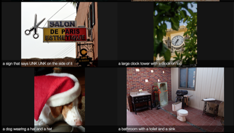
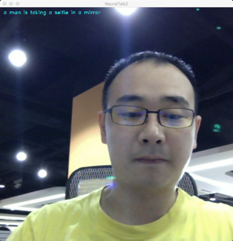
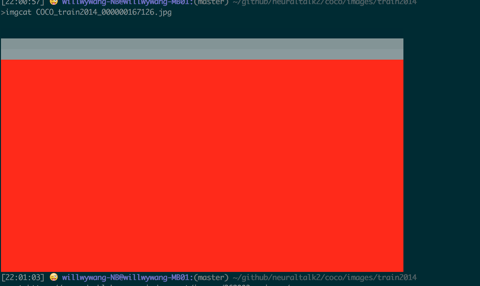
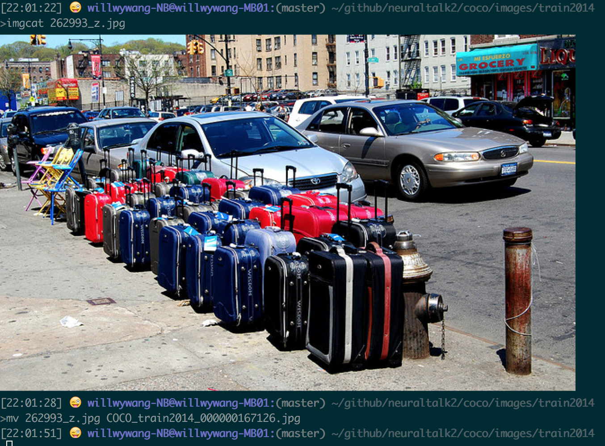

# Macbook搭建neuraltalks2(有网络)

为了研究Image Captioning, 首先搭建训练环境: [neuraltalks2](https://github.com/karpathy/neuraltalk2)。按照其github上的步骤, 会遇到一些阻碍, 我整理我遇到的问题如下。

我fork了一份代码到我的github.
git clone https://github.com/wang-yang/distro.git ~/github/torch --recursive

<!-- more -->

## 运行bash install-deps  

用于安装LuaJIT与Torch的基础依赖  

如果出现:  

>`/usr/local is not writable`

解决办法:   

> `sudo chown -R $(whoami) /usr/local`

如果遇到:

```
Error: git-2.9.0 already installed
To install this version, first `brew unlink git`
Error: cmake-3.5.2 already installed
To install this version, first `brew unlink cmake`
```

解决办法:

则unlink这两个组建, 然后重新运行bash install-deps  
遇到其他的已经安装的提示, 都unlink, 然后重新安装, 安装这些都需要网络

吐槽:
用mac的朋友升级系统版本一定要慎重, 升级到EI Capitan后好多东西都不能用了  
因为SIP保护的出现, 有些目录root都没有权限更改  

不断遇到没有的组件, 尝试pip先unintall, 再install, 如此循环就能解决  
(另外尝试执行下pip install --upgrade setuptools pip)

解决完后, 运行bash install-deps如下, 不过希望你一次成功, 不必这么费劲

```
>bash install-deps
Already up-to-date.
Warning: git-2.9.3 already installed
Warning: readline-6.3.8 already installed
Warning: cmake-3.6.1 already installed
Warning: wget-1.18 already installed
Warning: qt-4.8.7_2 already installed
Warning: jpeg-8d already installed
Warning: imagemagick-6.9.5-7 already installed
Warning: zeromq-4.1.5 already installed
Warning: graphicsmagick-1.3.24 already installed
Warning: openssl-1.0.2h_1 already installed
Warning: Already linked: /usr/local/Cellar/readline/6.3.8
To relink: brew unlink readline && brew link readline
Warning: A Cask for xquartz is already installed. Add the "--force" option to force re-install.
Uninstalling /usr/local/Cellar/gnuplot/5.0.4... (46 files, 2.8M)
==> Using the sandbox
==> Downloading https://downloads.sourceforge.net/project/gnuplot/gnuplot/5.0.4/gnuplot-5.0.4.tar.gz
Already downloaded: /Users/willwywang-NB/Library/Caches/Homebrew/gnuplot-5.0.4.tar.gz
==> ./configure --disable-silent-rules --prefix=/usr/local/Cellar/gnuplot/5.0.4 --with-readline=/usr/local/opt/readline --with-pdf=/usr/local/opt/pdflib-lite --with-qt=no --without-tutorial --without-lu
==> make
==> make install
🍺  /usr/local/Cellar/gnuplot/5.0.4: 46 files, 2.8M, built in 1 minute 4 seconds
==> Torch7 dependencies have been installed
```

## 运行./install.sh

此脚本用于安装LuaJIT, LuaRocks, 然后用LuaRocks安装torch, nn, path等

这里需要大量编译, 结束后在~/.bash_profile里加上:

`. /Users/willwywang-NB/github/torch/install/bin/torch-activate`

## 测试th（Torch)

which th看看安装位置对不对。以及能否运行th

## 用luarocks安装一些组建, 需要联网

```
luarocks install nn
luarocks install nngraph
luarocks install image
```

这三个其实已经跟着Torch一起装好了, 确认当前luarocks装了什么:

`luarocks list`


运行`luarocks list`时如果遇到:

```
Warning: "Failed loading manifest for /Users/willwywang-NB/.luarocks/lib/luarocks/rocks: /Users/willwywang-NB/.luarocks/lib/luarocks/rocks/manifest: No such file or directory"
```

解决办法:

```
mkdir -p ~/.luarocks/lib/luarocks/rocks
luarocks-admin make-manifest --local-tree --tree=$HOME/.luarocks
```

### 安装cjson:

在有网络情况下, 其实直接`luarocks install xxx`就可以安装。而我为了将来在无网络环境下也能安装, 下载了需要的依赖, 放到offline_rocks中, 然后都通过`luarocks make xxx.rockspec` 来手动安装。后面类似。

```
cd /Users/willwywang-NB/github/neuraltalks2/offline_rocks/lua-cjson-2.1.0
luarocks make lua-cjson-2.1.0-1.rockspec
```

两次(因为我装过一次, 第一次运行会卸载掉原来版本, 第二次是安装)

### 安装loadcaffe:

```
cd /Users/willwywang-NB/github/neuraltalk2/offline_rocks/loadcaffe-master
luarocks make loadcaffe-1.0-0.rockspec
```

### 安装hdf5

安装hdf5的luarocks前还需要安装hdf5本身。

```
brew uninstall hdf5
brew install hdf5
cd /Users/willwywang-NB/github/neuraltalk2/offline_rocks/torch-hdf5-master下
luarocks make hdf5-0-0.rockspec
```

因为我在本地安装的，有网络, hdf5依赖totem就自动下载安装了, 如果是在IDC环境没有网络, 同样手动安装

安装完hdf5还需要安装h5py,可以用pip安装: `pip install h5py`  
也可以用源码安装: `python setup.py install`  

我用的源码安装方式，需要下载相应源码:  
`/Users/willwywang-NB/github/neuraltalk2/offline_rocks/h5py-2.6.0`  

如果遇见:  

`Error: unable to locate HDF5 header file at hdf5.h`

解决办法:

`vim /Users/willwywang-NB/github/torch/install/share/lua/5.1/hdf5/config.lua`  
修改`HDF5_INCLUDE_PATH = "/usr/local/include"` (确认hdf5.h在那里)

### 本地用cpu版本, 因为本地显卡gpu显存太小了, 即使装了gpu版本需要的依赖也白搭

涉及到cutorch, cunn, cudnn, loadcaffe组建(GPU上安装时再说)

## 在本地执行evaluation脚本

### 下载pretrained模型:   (http://cs.stanford.edu/people/karpathy/neuraltalk2/checkpoint_v1.zip)

放到`/Users/willwywang-NB/github/neuraltalk2/model`下, 目前有3个模型:

1. model_id1-501-1448236541.t7 官方GPU的模型
2. model_id1-501-1448236541.t7_cpu.t7 官方CPU的模型
3. model_id_will_20160820.t7 自己训练出来的模型

### 准备参加evaluation的图片

放到`/Users/willwywang-NB/github/neuraltalk2/images`

### 运行eval.lua:

`th eval.lua -gpuid -1 -model model/model_id1-501-1448236541.t7_cpu.t7 -image_folder images/ -num_images 10`

运行过程会对图片生成描述:

```
[15:11:40] 😜  willwywang-NB@willwywang-MB01:(master) ~/github/neuraltalk2
>th eval.lua -gpuid -1 -model model/model_id1-501-1448236541.t7_cpu.t7 -image_folder images/ -num_images -1
includePath:   	/usr/local/include
headerPath:    	/usr/local/include/hdf5.h
DataLoaderRaw loading images from folder:      	images/
listing all images in directory images/
DataLoaderRaw found 94 images
constructing clones inside the LanguageModel
cp "images/000456.jpg" vis/imgs/img1.jpg
image 1: a bus is driving down the street in a city
evaluating performance... 1/-1 (0.000000)
cp "images/000542.jpg" vis/imgs/img2.jpg
image 2: a cat is sitting on the floor with a UNK
evaluating performance... 2/-1 (0.000000)
cp "images/001150.jpg" vis/imgs/img3.jpg
image 3: a woman sitting on a couch with a dog
evaluating performance... 3/-1 (0.000000)
cp "images/001763.jpg" vis/imgs/img4.jpg
image 4: a black and white dog laying on a bed
evaluating performance... 4/-1 (0.000000)
cp "images/004545.jpg" vis/imgs/img5.jpg
image 5: a woman riding a horse in a field
evaluating performance... 5/-1 (0.000000)
cp "images/005vbOHfgw1f4kkyzv4nrj30xc0m8wj9.jpg" vis/imgs/img6.jpg
image 6: a woman sitting on a bed with a dog
evaluating performance... 6/-1 (0.000000)
```

注意-gpuid -1表示用cpu, 否则会OOM  
命令会生成vis目录, 进入vis目录执行命令:

**启动浏览服务**:

`python -m SimpleHTTPServer 8081`

打开浏览器, 看网址:`localhost:8081` 可以得到图片和描述, 如下:



## 在本地使用摄像头实时生成描述

### 需要安装cv:

```
cd /Users/willwywang-NB/github/neuraltalk2/offline_rocks/opencv-3.1.0
mkdir release
cd release
cmake -D CMAKE_BUILD_TYPE=RELEASE -D CMAKE_INSTALL_PREFIX=/usr/local ..
```

如果遇到:

```
dyld: Symbol not found: __cg_jpeg_resync_to_restart
Referenced from:
/System/Library/Frameworks/ImageIO.framework/Versions/A/ImageIO
Expected in: /opt/local/lib/libJPEG.dylib
in /System/Library/Frameworks/ImageIO.framework/Versions/A/ImageIO
Trace/BPT trap: 5
```

解决办法:

```
cd /usr/local/lib
rm libgif.dylib
ln -s /System/Library/Frameworks/ImageIO.framework/Resources/libGIF.dylib libGIF.dylib
rm libjpeg.dylib
ln -s /System/Library/Frameworks/ImageIO.framework/Resources/libJPEG.dylib libJPEG.dylib
rm libtiff.dylib
ln -s /System/Library/Frameworks/ImageIO.framework/Resources/libTIFF.dylib libTIFF.dylib
rm libpng.dylib
ln -s /System/Library/Frameworks/ImageIO.framework/Resources/libPng.dylib libPng.dylib
```

继续，开始编译:

```
make -j 8(编译巨慢, 一定加上-j8)
sudo make install
```

安装luarocks:

```
cd /Users/willwywang-NB/github/neuraltalk2/offline_rocks/torch-opencv-master
luarocks make cv-scm-1.rockspec
```

### 开始实时描述

启动: `
th videocaptioning.lua -gpuid -1 -model model/model_id1-501-1448236541.t7_cpu.t7`

脚本会打开摄像头, 实时的生成描述



## 训练COCO数据集

本地其实不能训练, 因为训练需要GPU, 本地的macbook gt650M显存根本不够, OOM。只是把相应的步骤走一遍, 下载和安装所有的依赖和文件、及训练数据。

### 下载COCO数据集

#### 生成训练数据元数据

```
cd /Users/willwywang-NB/github/neuraltalk2/coco
ipython notebook coco_preprocess.ipynb
```

然后到浏览器里, 一步一步的执行, 看到coco目录里下载数据, 这其实是元数据, 是图片路径和描述  
下载得到`captions_train-val2014.zip`  
解压`captions_train-val2014.zip`得到`annotations`目录  
`annotations`目录里面包含两个文件: 每个文件包含元数据(图片路径+描述), 分别用于train和validation  
1. captions_val2014.json
2. captions_train2014.json

观察这个json数据:

```
print val.keys()
[u'info', u'images', u'licenses', u'annotations']

print val['info']
{u'description': u'This is stable 1.0 version of the 2014 MS COCO dataset.', u'url': u'http://mscoco.org', u'version': u'1.0', u'year': 2014, u'contributor': u'Microsoft COCO group', u'date_created': u'2015-01-27 09:11:52.357475'}

print len(val['images'])
40504

print len(val['annotations'])
202654

print val['images'][0]
{u'license': 3, u'file_name': u'COCO_val2014_000000391895.jpg', u'coco_url': u'http://mscoco.org/images/391895', u'height': 360, u'width': 640, u'date_captured': u'2013-11-14 11:18:45', u'flickr_url': u'http://farm9.staticflickr.com/8186/8119368305_4e622c8349_z.jpg', u'id': 391895}

print val['annotations'][0]
{u'image_id': 203564, u'id': 37, u'caption': u'A bicycle replica with a clock as the front wheel.'}
```

做一些预处理, 把train和val的数据合并成一个文件  
`/Users/willwywang-NB/github/neuraltalk2/coco/coco_raw.json`

#### 开始真正下载数据

先下载COCO图片, 放到`coco/images`下面, 用到两个文件`train2014.zip`和`val2014.zip`  

解压时如果遇到:

```
Archive:  train2014.zip
warning [train2014.zip]:  9205740423 extra bytes at beginning or within zipfile
(attempting to process anyway)
error [train2014.zip]:  start of central directory not found;
zipfile corrupt.
(please check that you have transferred or created the zipfile in the
appropriate BINARY mode and that you have compiled UnZip properly)
```

解决:

`用tar xzvf val2014.zip 正常解压``

解压完毕后把`val2014`和`train2014`都到`/Users/willwywang-NB/github/neuraltalk2/coco/images`下面

val2014有 40505 张图片  
train2014有 82784 张图片  

#### 解决一个已知bug(如果用的是原始train2014.zip, 就一定会遇到这个图片):

参考:<https://github.com/karpathy/neuraltalk2/issues/4>

有一个图片是坏的`COCO_train2014_000000167126.jpg`  
可以从这里下载替代: <https://msvocds.blob.core.windows.net/images/262993_z.jpg>

```
wget https://msvocds.blob.core.windows.net/images/262993_z.jpg ./
mv 262993_z.jpg COCO_train2014_000000167126.jpg
```

坏的图片:



好的图片:



#### 利用元数据真正开始生成训练数据

```
python prepro.py --input_json coco/coco_raw.json --num_val 5000 --num_test 5000 --images_root coco/images --word_count_threshold 5 --output_json coco/cocotalk.json --output_h5 coco/cocotalk.h5
```

如果遇到:

`No module named scipy.misc`

解决:

`pip install scipy`


最终生成cocotalk.h5文件(大约30G)


## 参考

[1] https://github.com/karpathy/neuraltalk2
