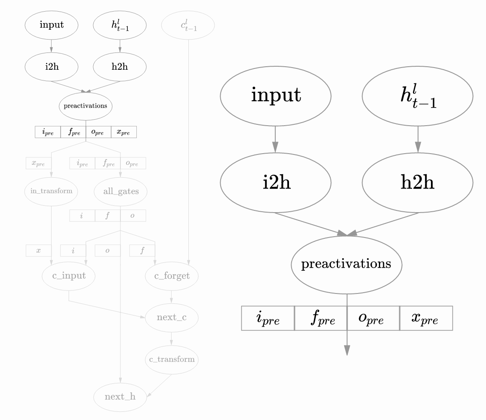
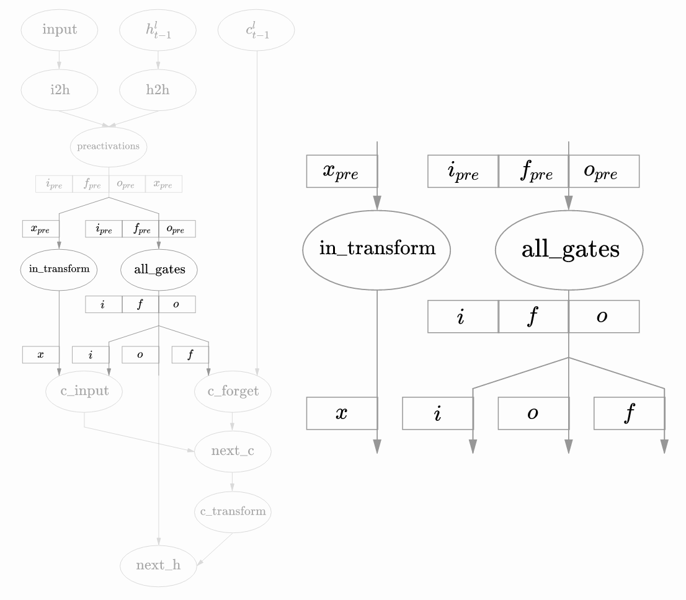
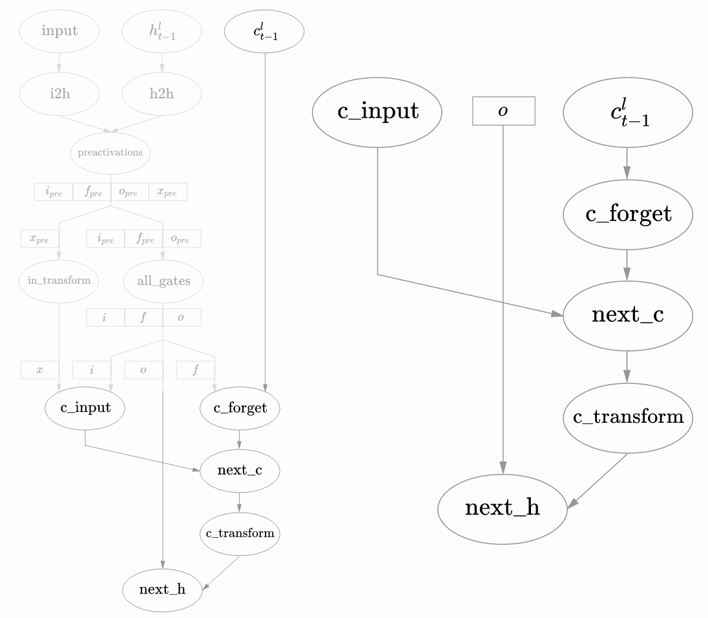
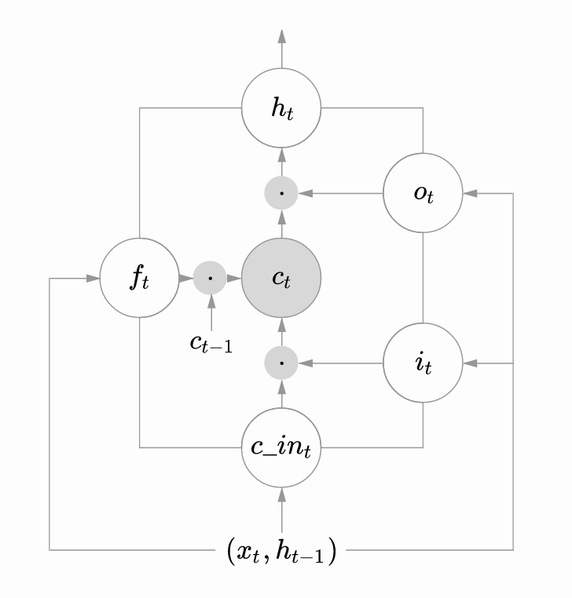
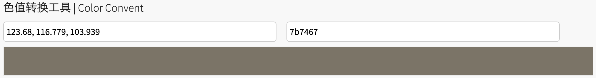

# 详解neuraltalks2代码

我们已经把neuraltalks2的环境搭建好了, 并制作了docker image方便后续部署。模型经过了初步训练, 现在进入精调阶段, 当前的CIDEr值是最高达到0.853。  
在更早之前我们也学习过了RNN, 并有过一段简短代码实现过char粒度的语言模型。  
neuraltalks2是一个RNN+CNN的模型, RNN负责语言模型部分, CNN负责图片特征提取部分, 在这些基础上，现在让我们一起深入的看下neuraltalks2的代码。

我在neuraltalks2中加入了大量的注释, 希望对你有所帮助.
代码参见:(https://github.com/wang-yang/neuraltalk2)

# 解析输入参数

注: 后续的代码解读为了更加形象，使用的都是具体的参数:
1. 一个batch是16张图
2. 1个图512维图像特征
3. 一个图有5个caption句子
4. LSTM的神经元是512个
5. 语言模型有1层LSTM
6. 经过处理后所有句子共有9567个独立单词
7. 每个caption句子长度是16，其余的截断哦
略

# 初始化训练数据加载模块: DataLoader

略

# 初始化网络

## 初始化LanguageModel

**输入参数lmOpt:**

* vocab_size: 9567
* input_encoding_size: 512
* rnn_size: 512
* num_layers: 1
* dropout: 0.5
* seq_length: 16 (LM)


### 初始化LM层的core: LSTM 网络

```lua
self.core = LSTM.lstm(self.input_encoding_size, self.vocab_size + 1, self.rnn_size, self.num_layers, dropout)
```

LSTM.lstm()实际上利用nngraph构造了LSTM网络。LSTM的代码在LSTM.lua中，**char-rnn** 也用到了相同的LSTM.lua。构造LSTM网络输入的参数是input_size, output_size, rnn_size, n(LSTM的层数), dropout的概率。  

LSTM.lua定义的LSTM网络支持多层LSTM。neuraltalks2中使用的是1层LSTM网络。

LSTM的输入是3个Tensor:
1. t时刻的输入x
2. prev_c, t-1时刻的cell state
3. prev_h, t-1时刻的hidden state

如下图最上面的三个就是输入: $input$, $h_{t-1}^l$, $c_{t-1}^l$ $l$表示第$l$层LSTM网络, **我们先只理解下单层LSTM网络,多层的类似**



先对input进行线性变换得到i2h

`i2h = nn.Linear(input_size_L, 4 * rnn_size)(x)`

对prev_h进行线性变换得到h2h

`h2h = nn.Linear(rnn_size, 4 * rnn_size)(prev_h)`

相加i2h和h2h, `all_input_sums`图里是`preactivations`

`all_input_sums = nn.CAddTable()({i2h, h2h})`

>上面是nngraph构造DAG的方法, 第一个()表示构造nn.Module, 第二个()表示这个Module的输入

把`all_input_sums`分成4份, 依次是:  
1. $i_{pre}$: prev in gate
2. $f_{pre}$: prev forget gate
3. $o_{pre}$: prev output gate
4. $x_{pre}$: prev x

```lua
local reshaped = nn.Reshape(4, rnn_size)(all_input_sums)
local n1, n2, n3, n4 = nn.SplitTable(2)(reshaped):split(4)
```

然后对3个gate和in_transform继续变换，如下图。图中的all_gates表示对3个gate进行了相同的变换




```lua
local in_gate = nn.Sigmoid()(n1)
local forget_gate = nn.Sigmoid()(n2)
local out_gate = nn.Sigmoid()(n3)
local in_transform = nn.Tanh()(n4)
```

用上面4个Tensor, 和prev_c继续去得到LSTM的输出, next_c和next_h, 如下图:



c_input由x(即in_transform)和i(即in_gate)得到

`nn.CMulTable()({in_gate, in_transform})`

c_forget由prev_c和f(即forget_gate)得到

`nn.CMulTable()({forget_gate, prev_c})`

next_c把c_input和c_forget相加

`next_c = nn.CAddTable()({c_forget, c_input})`

next_h把o(out_gate)和next_c的变换相乘得到

`next_h = nn.CMulTable()({out_gate, nn.Tanh()(next_c)})`

next_c和next_h即LSTM的输出。

在neuraltalks2的场景下, 把next_h经过线性变换后输出logsoft:

```
next_h = nn.Dropout(dropout)(next_h)
proj = nn.Linear(rnn_size, output_size)(next_h)
logsoft = nn.LogSoftMax()(proj)
```

logsoft的维度是9567+1(单词个数, )加上LogSoftMax, 使之具有概率分布意义, 9567+1中概率最大的就是预测出来的下一个单词。


### LSTM公式

上面看了LSTM的实现, 再来看下理论的公式, 结合图加深对齐理解。



上图是一个原生的LSTM网络。虽然LSTM有很多变种, 我们这里只看一看这个原始简单款。一个LSTM cell包含了3个gate(input, forget, output)和一个cell unit, gate分别由$i_t$, $f_t$, $o_t$表示。cell unit是$c_t$。gate使用sigmoid激活函数, 输入$x_t$和cell state使用tanh激活函数。公式如下:

#### Gate:

$i_t = g(W_{xi}x_t+W_{hi}h_{t-1}+b_i)$

$f_t = g(W_{xf}x_t+W_{hf}h_{t-1}+b_f)$

$o_t = g(W_{xo}x_t+W_{ho}h_{t-1}+b_o)$

#### Input transform:

$c\_in_t = tanh(W_{xc}x_t+W_{hc}h_{t-1}+b_{c\_in})$

#### State update: 下面是element-wise 乘法

$c_t = f_t \cdot c_{t-1} + i_t \cdot c\_in_t$

$h_t = o_t \cdot tanh(c_t)$


### 代码和公式的对应

$W_{xi}$, ${W_xf}$, $W_{xo}$, $W_{xc}$ 一起对应于代码中的**i2h**
$W_{hi}$, ${W_hf}$, $W_{ho}$, $W_{hc}$ 一起对应于代码中的**h2h**

至此LSTM网络部分分析完毕, 继续前再回顾下:

```
self.core = LSTM.lstm(self.input_encoding_size, self.vocab_size + 1, self.rnn_size, self.num_layers, dropout)
```


### 初始化lookup_table

在初始化LanguageModel中, 构造LSTM网络后, 会初始化lookup_table

`self.lookup_table = nn.LookupTable(self.vocab_size + 1, self.input_encoding_size) -- 9567+1, 512`

nn.LookupTable的ref: <https://github.com/torch/nn/blob/master/doc/convolution.md#nn.LookupTable>

比如建立了`nn.LookupTable(10, 3)`, 我理解LookUpTable的forward如果输入的是1维的{1,2,1,10}, 就会按照输入{1,2,1,10}把table中以输入作为索引的Tensor取出来, LookupTable里有10个size是3的Tensor。

### LanguageModel:\_createInitState

用于初始化self.init_state，比如LSTM的层数是1, 那么self.init_state是
`self.init_state[1]: tensor(1, 512)`  
`self.init_state[2]: tensor(1, 512)`  
初始化为0


## 初始化CNN网络

这个CNN网络结构如下:

```
nn.Sequential {
  [input -> (1) -> (2) -> (3) -> (4) -> (5) -> (6) -> (7) -> (8) ->
  (9) -> (10) -> (11) -> (12) -> (13) -> (14) -> (15) -> (16) ->
  (17) -> (18) -> (19) -> (20) -> (21) -> (22) -> (23) -> (24) ->
  (25) -> (26) -> (27) -> (28) -> (29) -> (30) -> (31) -> (32) -> (33) -> (34) -> (35) -> (36) -> (37) -> (38) -> (39) -> (40) -> output]
  (1): cudnn.SpatialConvolution(3 -> 64, 3x3, 1,1, 1,1)
  (2): cudnn.ReLU
  (3): cudnn.SpatialConvolution(64 -> 64, 3x3, 1,1, 1,1)
  (4): cudnn.ReLU
  (5): cudnn.SpatialMaxPooling(2x2, 2,2)
  (6): cudnn.SpatialConvolution(64 -> 128, 3x3, 1,1, 1,1)
  (7): cudnn.ReLU
  (8): cudnn.SpatialConvolution(128 -> 128, 3x3, 1,1, 1,1)
  (9): cudnn.ReLU
  (10): cudnn.SpatialMaxPooling(2x2, 2,2)
  (11): cudnn.SpatialConvolution(128 -> 256, 3x3, 1,1, 1,1)
  (12): cudnn.ReLU
  (13): cudnn.SpatialConvolution(256 -> 256, 3x3, 1,1, 1,1)
  (14): cudnn.ReLU
  (15): cudnn.SpatialConvolution(256 -> 256, 3x3, 1,1, 1,1)
  (16): cudnn.ReLU
  (17): cudnn.SpatialMaxPooling(2x2, 2,2)
  (18): cudnn.SpatialConvolution(256 -> 512, 3x3, 1,1, 1,1)
  (19): cudnn.ReLU
  (20): cudnn.SpatialConvolution(512 -> 512, 3x3, 1,1, 1,1)
  (21): cudnn.ReLU
  (22): cudnn.SpatialConvolution(512 -> 512, 3x3, 1,1, 1,1)
  (23): cudnn.ReLU
  (24): cudnn.SpatialMaxPooling(2x2, 2,2)
  (25): cudnn.SpatialConvolution(512 -> 512, 3x3, 1,1, 1,1)
  (26): cudnn.ReLU
  (27): cudnn.SpatialConvolution(512 -> 512, 3x3, 1,1, 1,1)
  (28): cudnn.ReLU
  (29): cudnn.SpatialConvolution(512 -> 512, 3x3, 1,1, 1,1)
  (30): cudnn.ReLU
  (31): cudnn.SpatialMaxPooling(2x2, 2,2)
  (32): nn.View(-1)
  (33): nn.Linear(25088 -> 4096)
  (34): cudnn.ReLU
  (35): nn.Dropout(0.500000)
  (36): nn.Linear(4096 -> 4096)
  (37): cudnn.ReLU
  (38): nn.Dropout(0.500000)
  (39): nn.Linear(4096 -> 512)
  (40): cudnn.ReLU
}
```

原始的VGG16是38层，最后两层是这里加入的  
这里先不深入这个CNN，把其当作一个黑盒处理，forward输入一批图片, 得到这批图片的一组图像特征feats(16,512)  

## 初始化nn.FeatExpander网络

做的事情是把(16,512)变成(16*5,512), 把原来的每个图片对应的512图像特征复制5份

## 初始化nn.LanguageModelCriterion网络

# 针对模型参数做一些预处理

## 获取LM和CNN的参数

### LanguageModel:getParameters()

在初始化了LM后, 进入training main loop前。

`local params, grad_params = protos.lm:getParameters()`

把LM的params和grad_params取出, LM中有两个内部module, core和lookup_table,
params是core和lookup_table的params和在一起的, grad_params也是和在一起的。

lm的总params个数是11908448, 是汇总了core(即LSTM)和lookup_table的

lookup_table是(9567+1, 512)的tensor, 个数是4898816

core则有6个部分构成, 分别的sub-params个数是:
1. i2h.weight:  (input_size, 4*rnn_size)   (512, 4*512)  1048576
2. i2h.bias:    (1,          4*rnn_size)   (1,   4*512)  2048
3. h2h.weight:  (rnn_size,   4*rnn_size)   (512, 4*512)  1048576
4. h2h.bias:    (1,          4*rnn_size)   (1,   4*512)  2048
5. proj.weight: (rnn_size,   output_size)  (512, 9567+1) 4898816
6. proj.bias:   (1,          output_size   (1,   9567+1) 9568

grad_params是跟params一样的。

## 生成用于checkpoint的薄参数, 并作裁剪

其实就是去掉所有的gradWeight, 只保留weight

## 构建LM的18个子层

### LanguageModel:createClones()
经过createClones后, LM里面会有18个子层, 16+2。  
16表示会记忆16个单词长度的caption  
2表示了开头和结尾  
每个子层都是一个LSTM+LookupTable, 子层间共享参数  
LSTM共享weight, bias, gradWeight, gradBias，共7009632参数，具体LSTM的参数构成见上面core的6个组成部分。
LookupTable共享weight, gradWeight，共4898816参数
(9567+1, 512)  

createClones()是neuraltaks2初始话模型的最后一个步骤, 这个之后就会进入train的主循环。


# 训练主流程

先跳过validation过程, validation过程是每隔`opt.save_checkpoint_every`次进行一次，一般是2500轮迭代, validation的过程在`eval_split`中。模型的forward和backward过程都在lossFun()中进行。我们先看看Loss Function.

## Loss Function

先设置CNN和LM的网络状态到train

```
protos.cnn:training()
protos.lm:training()
```

给grad_params清零
```
grad_params.zero()
```

option: 非CNN精调时跳过清零 `cnn_grad_params`

### Loss Function中的forward pass

先用`loader:getBatch`获取一批训练数据，包括image向量和label向量。  

然后调用`net_utils.prepro`对图像进行预处理: 把图片由256*256转换成224*224的区域。把imgs对应的向量转换到GPU(如果用了gpu)，然后把图像用vgg_mean"蒙板"处理下, 直观理解就是把所有的图片的(224,224)区域的RGB色域都减去vgg_mean中的RGB值.

```
if not net_utils.vgg_mean then
    net_utils.vgg_mean = torch.FloatTensor{123.68, 116.779, 103.939}:view(1,3,1,1) -- in RGB order
    print("net_utils.prepro, init net_utils.vgg_mean", net_utils.vgg_mean)
end
net_utils.vgg_mean = net_utils.vgg_mean:typeAs(imgs) -- a noop if the types match
print("net_utils.prepro, after typsAs(imgs) net_utils.vgg_mean", net_utils.vgg_mean)
imgs:add(-1, net_utils.vgg_mean:expandAs(imgs))
```

这个vgg_mean的颜色如下:


将预处理后的data.images喂给CNN网络`protos.cnn:foward(data.images)`  


将feats喂给`protos.expander:foward(feats)`  
feats是(16,512)的Tensor, 表示16个图片的图像特征, 经过expander层后, 变成(16*5,512)的Tensor, 把原来的每个图片对应的512图像特征复制5份  
train.lua中调用的是`expander:forward(feats)`, 按照Torch.nn的文档, 所有继承了nn.Module的层, 不建议覆盖forward(), 应该实现updateOutput()

将经过expander层处理后的expanded_feats (16*,512)的向量, 联同data.labels喂给LM层  
`local logprobs = protos.lm:forward{expanded_feats, data.labels}`  

LanguageModel的forward()需要着重看下

#### LanguageModel的forward过程

lm:forward()实际定义在nn.LanguageModel:updateOutput()  
参数是外层通过{}传进来的,是个table,是两个参数imgs和seqs  
先确认self.clones存在, 因为LM模型的核心是LSTM, 我们设置的语言模型关心16个前置状态，加上开头和结尾，需要18个LSTM子层。self.clones中就是这些子层, 这些子层彼此间是共享一组参数的。

对于一次forward()过程, batch_size是16*5, 表示16个图片对应的各5个caption

LM:forward()的输入包含两部分: imgs和seqs。imgs是(16*5,512)维Tensor。原本一个batch的16张图，经过扩张后由1变5, 复制了5个相同的图像, 每个图像是512维的图像特征。最终形成了(80,512)的tensor。seqs是(16,16*5)的Tensor, 前一个16是每个caption句子的单词个数, 后面的16*5是caption句子的总体个数，跟扩展后的图片个数一样。

在进入LanguageModel后，算上最开始的图片+表示START的token+每个句子的16个单词，总共会有18轮迭代。每轮迭代都是把当前的输入放入到LSTM网络中, 使用当前的输入和LSTM的上一时刻隐状态更新LSTM的隐状态(hidden_state, cell_state)。一轮迭代中, 除了最开始的imgs和START token,其余的16轮迭代会出去当前时刻的单词(80,1),然后从lookup_table中得到对应的input_encoding, 每个单词被encoding到512维空间, 最终得到(80,512)的输入xt, xt与h_prev和c_prev进入到LSTM中, 得到当前时刻的输出(80,9568)并更新LSTM内部的h和c状态。

最终LM的forward的输出是(18,80,9568)，表示的是每个时刻(共18个时刻), 对于80个句子预测的下一个单词是什么(9568个单词上的概率)。

#### LM criterion过程

利用logprobs和data.labels, 一个是预测的输出, 一个是实际的输出, 计算出loss, loss用于观察当前的训练情况。同时计算出dlogprobs, 是整个forward过程loss的梯度。

### Backward 过程

#### Criterion的backward()

实际上什么也没有做, loss的梯度是在forward()期间就计算了的

#### LanguageModel的backward()

这个里面实际上是16个LSTM子层, 利用loss的梯度, 从后往前的去计算每个LSTM层隐状态(cell_state, hidden_state)的梯度.
backward()的输出是imgs图像特征的梯度

#### CNN的backward()

当需要CNN精调时, 先把图像特征的梯度经过expander的backward过程, 把原先扩展过的图像特征的梯度(16*5，512)缩窄到原来(16，512)。然后把这个喂给cnn的backward去计算cnn的参数的梯度。

## 使用各层的梯度,更新模型参数

### 更新LM的参数

使用adam(sgd/sgdm/rmsprop等)，把梯度grad_params更新到params中

### 更新CNN参数

只有在opt.finetune_cnn_after>0时才会更新CNN的参数  
finetune指的就是更新CNN网络
训练的第一阶段只更新LM的参数  
第二阶段进入opt.finetune_cnn_after 0表示从第一阶段的checkpoint开始训练，
如果精调CNN, 则把cnn_grad_params更新到cnn_params中


## 后续

整体过程就是上面所属, 训练主要流程就是先计算loss, 然后是loss的梯度(dlogprobs), 然后利用loss的梯度由网络的最后面逐层的计算各层参数的梯度，即先是LM内部各LSTM子层隐状态的梯度(cell_state, hidden_state)，然后是imgs的梯度, 然后去更新CNN的梯度
